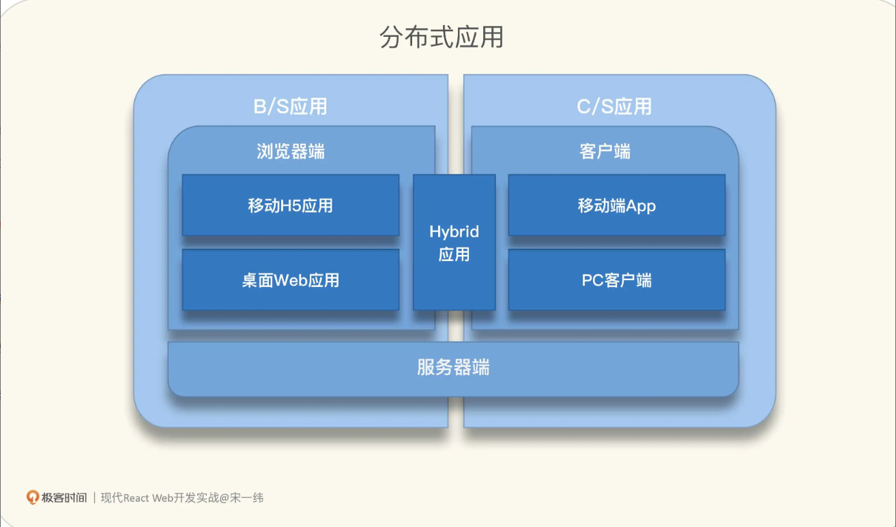

### 前端界面也是接口

GUI `Graphical User Interface`

用户只关注与应用界面的交互，而不需要关注界面后面对应的程序是怎么实现的. 作为前端, 是这类 "接口" 的负责人, 也是实现着, 用户是接口的使用者


GUI 作为接口也有它特有的设计准则

- 可用性
- 一致性: 单一界面标准，能够通过提高产出和减少错误，改善用户学习界面的能力和提高生产率
- 遵循用户心智模型, 避免实现模型
- 最小惊讶原则
- 及时反馈

### 自顶向下看架构

#### 前端应用分类

- B/S 应用
  - 浏览器端
    - 移动H5应用
    - 桌面Web应用
  - 服务器端
- C/S 应用
  - 客户端
    - 移动端App
    - PC客户端
  - 服务器端



#### 前端逻辑架构

- SPA单页应用(Single Page Application)
- MPA多页应用(Multi-Page Applocation)

#### 前端应用架构

- MVC (Model-View-Controller)
  - 视图会触发控制器，控制器修改模型，模型再触发视图更新
- MVVM(Model-View-ViewModel)
- MVP(Model-View-Presenter)
- MVI(Model-View-Intent) 最接近 React 社区里提倡的单向数据流

#### React对应技术点

第一, MVC或类MVC框架

- 声明式 JSX 语法
- 组件
- 单向数据流机制进行应用状态管理
- 虚拟 DOM 模型, 比对新旧两个虚拟 DOM 来实现低成本的渲染

第二, 表单处理

React 框架本身并没有提供高度抽象的表单处理组件或者接口, 但在 React 开发者可以将 HTML 表单元素声明为 `受控组件(controlled components)`, 基于受控组件状态数据进行表单处理

第三, 错误处理

React 没有内建处理全局错误的机制, 但提供了 `错误边界(Error boundaries)`, 可以在组件树中实现类似 `try...catch`的功能


### 快速搭建一个 React 项目

1. 安装Node
2. 安装一个编辑器 VsCode
3. 使用 vite 或者 webpack 创建一个项目
4. 开发项目: 从整体到局部, 从简单到复杂, 从视图到交互, 从数据到逻辑

### JSX: 声明式语法糖

JSX 则直接利用了 JS 语句, JS 表达式能做的，JSX 都能做

```jsx
// 组件渲染, JSX 是 createElement 函数的语法糖
React.createElement(component, props, ...children)

<header className="App-header">
  <h1>我的看板</h1>
</header>

React.createElement("header", {className: "App-header"},
  React.createElement("h1", null, "我的看板")
);
```

1. JSX 的基本写法

```jsx
// type 参数是必须得
// props 可选
// 当参数数量大于等于 3 时，可以有一个或多个 children
React.createElement(type)
React.createElement(type, props)
React.createElement(type, props, ...children)

// 踏入 JS 自动加分号的陷阱
function Component() {
  return 
    <div>{/*假设这行JSX语句很长，为了提升一些代码可读性才特地换行*/}</div>;
}

// 编译
function Component() {
  return;
  React.createElement("div", null);
}

// JSX 加上括号
function Component() {
  return (
    <div>{/*假设这行JSX语句很长，为了提升一些代码可读性，特地换行*/}</div>
  );
}

function Component() {
  return React.createElement("div", null);
}
```

2. 命名规则

```js
// 自定义React 组件, 变量名或函数名, 大写在木开头
function MyApp() {
  return (<div></div>);
}

// 在 JSX 中编写标签时，HTML 元素名称均为小写字母，自定义组件首字母务必大写
<h1>我的看板</h1>
<KanbanCard />

// props 驼峰命名 camelCase, 且区分大小写
<FileCard filename="文件名" fileName="另一个文件名" />
```

3. JSX 元素类型

```jsx
// React 封装的 DOM 元素, 渲染为 真实DOM
<div></div>
 

// React 组件渲染的元素 会调用对应组件的渲染方法
<KanbanCard />

// React Fragment 元素, 没有业务意义，也不会产生额外的 DOM，主要用来将多个子元素分组, 没有props
<React.Fragment></React.Fragment>
<></>
```

4. JSX 子元素类型

子元素不一定是子组件，子组件一定是子元素, 类型包括

- 字符串, 最终会被成 HTML 标签里的字符串
- 另一段 JSX, 会嵌套渲染
- JS 表达式, 会在渲染过程中执行, 并让返回值参与到渲染过程中
- 布尔值 null undefined 不会被渲染
- 以上各种类型组成的数组

5. JSX 中的 JS 表达式

JS 表达式，特征是用大括号 { } 包起来

- 作为 props 值, `<button disabled={showAdd}>添加新卡片</button>`
  - 属性展开`<KanbanCard {...props} />` 利用 JS `...` 语法把 props 这个对象中的所有属性都传给 KanbanCard 组件
- 作为 JSX 元素的子元素 `<div className="card-title">{title}</div>`

6. JSX 与 React 组件的关系

```jsx
// React v13 v14 版本
const KanbanCard = React.createClass({
  render: function() {
    return (<div>KanbanCard ...</div>);
  }
});
class KanbanCard extends React.Component {
  render() {
    return (<div>KanbanCard {this.props.title}</div>);
  }
}
// v14 简化的无状态函数组件
// ES6箭头函数
const KanbanCard = (props) => {
  var title = props.title;
  return (<div>KanbanCard {title}</div>);
};
  
// 更简单的箭头函数+参数解构
const KanbanCard = ({title}) => (
  <div>KanbanCard {title}</div>
);


// v16.8 Hooks 函数组件取代类组件成为了 React 组件的 C 位
```

函数组件上位:

- React 哲学: `UI=f(state) `
- 更彻底的关注点分离（Separation Of Concerns）
- 函数式编程的影响；
- React 内部实现的不断优化；
- 开源社区的反哺。


### 前端组件化: 如何拆分成 React 组件?

