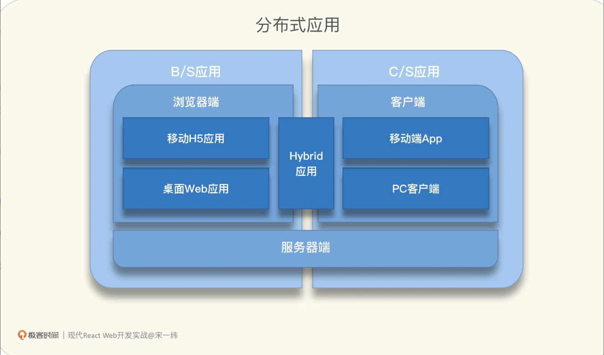

### 前端界面也是接口

GUI `Graphical User Interface`

用户只关注与应用界面的交互，而不需要关注界面后面对应的程序是怎么实现的. 作为前端, 是这类 "接口" 的负责人, 也是实现着, 用户是接口的使用者


GUI 作为接口也有它特有的设计准则

- 可用性
- 一致性: 单一界面标准，能够通过提高产出和减少错误，改善用户学习界面的能力和提高生产率
- 遵循用户心智模型, 避免实现模型
- 最小惊讶原则
- 及时反馈

### 自顶向下看架构

#### 前端应用分类

- B/S 应用
  - 浏览器端
    - 移动H5应用
    - 桌面Web应用
  - 服务器端
- C/S 应用
  - 客户端
    - 移动端App
    - PC客户端
  - 服务器端



#### 前端逻辑架构

- SPA单页应用(Single Page Application)
- MPA多页应用(Multi-Page Applocation)

#### 前端应用架构

- MVC (Model-View-Controller)
  - 视图会触发控制器，控制器修改模型，模型再触发视图更新
- MVVM(Model-View-ViewModel)
- MVP(Model-View-Presenter)
- MVI(Model-View-Intent) 最接近 React 社区里提倡的单向数据流

#### React对应技术点

第一, MVC或类MVC框架

- 声明式 JSX 语法
- 组件
- 单向数据流机制进行应用状态管理
- 虚拟 DOM 模型, 比对新旧两个虚拟 DOM 来实现低成本的渲染

第二, 表单处理

React 框架本身并没有提供高度抽象的表单处理组件或者接口, 但在 React 开发者可以将 HTML 表单元素声明为 `受控组件(controlled components)`, 基于受控组件状态数据进行表单处理

第三, 错误处理

React 没有内建处理全局错误的机制, 但提供了 `错误边界(Error boundaries)`, 可以在组件树中实现类似 `try...catch`的功能


### 快速搭建一个 React 项目

1. 安装Node
2. 安装一个编辑器 VsCode
3. 使用 vite 或者 webpack 创建一个项目
4. 开发项目: 从整体到局部, 从简单到复杂, 从视图到交互, 从数据到逻辑

### JSX: 声明式语法糖

JSX 则直接利用了 JS 语句, JS 表达式能做的，JSX 都能做

```jsx
// 组件渲染, JSX 是 createElement 函数的语法糖
React.createElement(component, props, ...children)

<header className="App-header">
  <h1>我的看板</h1>
</header>

React.createElement("header", {className: "App-header"},
  React.createElement("h1", null, "我的看板")
);
```

1. JSX 的基本写法

```jsx
// type 参数是必须得
// props 可选
// 当参数数量大于等于 3 时，可以有一个或多个 children
React.createElement(type)
React.createElement(type, props)
React.createElement(type, props, ...children)

// 踏入 JS 自动加分号的陷阱
function Component() {
  return 
    <div>{/*假设这行JSX语句很长，为了提升一些代码可读性才特地换行*/}</div>;
}

// 编译
function Component() {
  return;
  React.createElement("div", null);
}

// JSX 加上括号
function Component() {
  return (
    <div>{/*假设这行JSX语句很长，为了提升一些代码可读性，特地换行*/}</div>
  );
}

function Component() {
  return React.createElement("div", null);
}
```

2. 命名规则

```js
// 自定义React 组件, 变量名或函数名, 大写在木开头
function MyApp() {
  return (<div></div>);
}

// 在 JSX 中编写标签时，HTML 元素名称均为小写字母，自定义组件首字母务必大写
<h1>我的看板</h1>
<KanbanCard />

// props 驼峰命名 camelCase, 且区分大小写
<FileCard filename="文件名" fileName="另一个文件名" />
```

3. JSX 元素类型

```jsx
// React 封装的 DOM 元素, 渲染为 真实DOM
<div></div>
 

// React 组件渲染的元素 会调用对应组件的渲染方法
<KanbanCard />

// React Fragment 元素, 没有业务意义，也不会产生额外的 DOM，主要用来将多个子元素分组, 没有props
<React.Fragment></React.Fragment>
<></>
```

4. JSX 子元素类型

子元素不一定是子组件，子组件一定是子元素, 类型包括

- 字符串, 最终会被成 HTML 标签里的字符串
- 另一段 JSX, 会嵌套渲染
- JS 表达式, 会在渲染过程中执行, 并让返回值参与到渲染过程中
- 布尔值 null undefined 不会被渲染
- 以上各种类型组成的数组

5. JSX 中的 JS 表达式

JS 表达式，特征是用大括号 { } 包起来

- 作为 props 值, `<button disabled={showAdd}>添加新卡片</button>`
  - 属性展开`<KanbanCard {...props} />` 利用 JS `...` 语法把 props 这个对象中的所有属性都传给 KanbanCard 组件
- 作为 JSX 元素的子元素 `<div className="card-title">{title}</div>`

6. JSX 与 React 组件的关系

```jsx
// React v13 v14 版本
const KanbanCard = React.createClass({
  render: function() {
    return (<div>KanbanCard ...</div>);
  }
});
class KanbanCard extends React.Component {
  render() {
    return (<div>KanbanCard {this.props.title}</div>);
  }
}
// v14 简化的无状态函数组件
// ES6箭头函数
const KanbanCard = (props) => {
  var title = props.title;
  return (<div>KanbanCard {title}</div>);
};
  
// 更简单的箭头函数+参数解构
const KanbanCard = ({title}) => (
  <div>KanbanCard {title}</div>
);


// v16.8 Hooks 函数组件取代类组件成为了 React 组件的 C 位
```

函数组件上位:

- React 哲学: `UI=f(state) `
- 更彻底的关注点分离（Separation Of Concerns）
- 函数式编程的影响；
- React 内部实现的不断优化；
- 开源社区的反哺。


### 前端组件化: 如何拆分成 React 组件?

1. 为什么组件化?

组件是对视图以及与视图相关的逻辑 数据 交互等的封装.

比组件化更进一步 组件层次结构(Hierarchy)

- 将前端应用需要承担的业务和技术复杂度分摊到多个组件中去，并把这些组件拼装在一起

2. 用 JSX 协助拆分 React 组件

可以用 JSX 来快速验证拆分出来的组件层次结构

props 中都有一个叫 children 的属性，这个属性一般不需要显式地传值，只要在 JSX 中写这个组件的标签时,在闭合标签内部加入子元素即可，子元素会自动作为 children 传给标签对应的组件

真·子组件（Sub-components）的设计模式


3. 拆分组件的基本原则

- 单一职责
- 关注点分离
- 一次且仅一次 (Don't Repeat Yourself)
- 简约

4. 对 React 子组件概念的澄清

React 没有组件树（Component Tree），只有元素树（Element Tree），即从根元素开始，父元素子元素之间形成的树

从组件声明层面: 在一个组件返回的 JSX 中，加入另一个组件作为子元素，那么可以说前者是父组件，后者是子组件。父子组件形成的树即为组件树

从组件实例层面: 组件树是来自运行时的 React 元素树、从逻辑上排除掉 HTML、Fragment 等元素，仅保留对应 React 组件的元素节点而形成的精简树


### 虚拟DOM

虚拟DOM (Virtual DOM), 是相对于 HTML DOM 更轻量的 JS 模型, 

操作真实DOM是比较耗费资源的, 大量调用 DOM API 绘制页面，页面很容易就卡

React 的声明式 API，在此基础上，每次有 props、state 等数据变动时，组件会渲染出新的元素树，React 框架会与之前的树做 Diffing 对比，将元素的变动最终体现在浏览器页面的 DOM 中。这一过程就称为`协调（Reconciliation）`

1. Diffing 算法

- 从根元素开始, 递归对比两棵树的根元素和子元素
- 对比不同类型的元素, 比如对比 html 和 React组件元素, React 会直接清理旧的元素和子树, 建立新的树
- 对比同为HTML元素, 但 Tag 不同的元素, 如从 `<a>` 变为 `<div>`, React 会直接清理旧的元素和子树，然后建立新的树
- 对比同为 React 组件元素 ,但组件类或组件函数不同的元素，如从 KanbanNewCard 变成 KanbanCard ，React 会卸载旧的元素和子树，然后挂载新的元素树
- 对比Tag相同的HTML元素, 如  `<input type="text" value="old" />` 和 `<input type="text" value="new" />` React 保留该元素, 并记录有改变的属性, 在之前, old => new
- 对比组件类或组件函数相同的组件元素, 如 `<KanbanCard title="老卡片" />` 和 `<KanbanCard title="新卡片" />`, React会保留组件实例, 更新props, 出发组件的声明周期或者hoks

强调: 对比两棵树对应节点的子元素时，如果子元素形成一个列表，那么 React 会按顺序尝试匹配新旧两个列表的元素

React 引入了 key 这个特殊属性，当有子元素列表中的元素有这个属性时，React 会利用这个 key 属性值来匹配新旧列表中的元素，以减少插入元素时的性能损耗

2. 触发协调的场景

- props 从组件外面传进来 不可变(immutable)
- state 活跃在组件内部 不可变(immutable)
- context 组件外面的 Context.Provider 提供数据，组件内部则可以消费 context 数据

3. 什么是 Fiber 协调引擎

在React早期版本, 协调是一个`同步过程`, 意味着当虚拟 DOM 足够复杂，或者元素渲染时产生的各种计算足够重，协调过程本身就可能超过 16ms，严重的会导致页面卡顿

Reactv16 开始, 协调从之前的同步改成了 `异步过程`, 得益于 Fiber 协调引擎, 在 React 中更贴近虚拟 DOM 的，是在 Fiber 协调引擎中的`核心模型 FiberNode`

FiberNode 依靠对元素到子元素的双向链表, 子元素到子元素的单向链表实现了一棵树, 这棵树可以随时暂停并回复渲染, 触发组件声明周期等副作用(Side-effect), 并将中间结果分散保存在每一个节点上, 不会 block 浏览器的其他工作


### CSS-in-JS

1. Emotion
2. Styled-components
3. CSS Modules


### 组件声明周期, 新老版本演化

1. 类组件声明周期方法

一个类组件声明周期包含 挂载(Mounting) 更新(Updating) 卸载(Unmounting) 错误处理(Error Handing)

错误处理: `getDerivedStateFromError` `componentDidCatch`, 错误边界(Error Boundary), 如果当前组件不是错误边界, React会去找父组件, 父组件没有,继续往上, 知道根组件, 谁都没有, 应用就挂了, 截止到 Reactv18.2.0, 只有类组件才能称为错误边界, 函数组件不行  

2. 用 Hooks 定义函数组件声明周期

- 挂载阶段, React会执行组件函数, 在函数执行过程中遇到`useState useMemo`等Hooks依次挂载到 FiberNode, useEffect其实也会被挂载, 但它的副作用会保留到提交阶段
- 更新阶段. 当组件接收新的 props, 调用 `useState`返回的setter或者 `useReducer` 返回的 `dispatch` 修改了状态, 组件就进入更新阶段, 函数本身会被再次执行,组件函数的返回值用来更新 FiberNode 树
- 卸载阶段, 主要执行Effect的清除函数


函数组件也有错误处理阶段，但没有对应的生命周期 Hooks，错误处理依赖于父组件或祖先组件提供的错误边界。

### React Hooks

1. 什么是Hooks

Hooks 是 React 实现组件逻辑的重要方式，可以用来操作 state, 定义副作用，更支持开发者自定义 Hooks,
Hooks 借鉴自函数式编程，但同时在使用上也有一些限制

```js
// UI 视图
// State 应用状态
// f 渲染过程
UI = f(state)
```

纯函数: 函数无论被调用多少次, 只要参数相同, 返回值就一定相同, 这一过程不受外部被掠夺或者 IO操作影响; 函数被调用时不会产生副作用, 即不会修改传入的引用参数, 不会修改外部状态不会调用其他产生副作用的函数

```js
const func = (a, b) => {
  return a + b
}

// 函数组件，每次在渲染阶段都会被执行
// 返回的元素树经过协调引擎比对后，与前一次的没有差异，则在提交阶段不会更新对应的真实 DOM
const Component = ({ a, b }) => {
  const [m, setM] = useState(a); // 一个Hook
  const [n, setN] = useState(b); // 另一个Hook
  return (
    <ul>
      <li>{m}<button onClick={() => setM(m + 1)}>+</button></li>
      <li>{n}<button onClick={() => setN(n + 1)}>+</button></li>
    </ul>
  );
};
```

2. React Hooks ?

- useState
- useEffect
- useContext
- useRef
- 需要性能优化, 减少不必要的渲染 `useMemo useCallback`
- 处理复杂state `useReducer`
- 需要封装组件, 对外提供命令式接口, `useRef 加 useImperativeHandle`
- 用户操作相关, 受到异步渲染拖累卡顿时, `useDeferredvalue useTransition`

3. 状态 Hook useState

```js
import React, { useState } from 'react';
// ...省略
function App() {
  const [showAdd, setShowAdd] = useState(false);
  //     -------  ----------             -----
  //        ^         ^                    ^
  //        |         |                    |
  //    state变量  state更新函数           state初始值
  const [todoList, setTodoList] = useState([/* ...省略 */]);

  // 传一个函数作为参数, 只在组件挂载时执行一次这个函数
  const [] = useState(() => fibonacci(40))
```

在挂载时, 组件内会创建一个新的 state, 初始值 false, 返回值是包含两个成员的数组
每次组件更新, 渲染阶段都会再次调用 useState() 函数, 不会重新初始化 state, 保证值是最新的

调用 state 更新函数后, 组件的更新是异步的, 不会马上执行, React18 为更新 state 加入 自动批处理 功能, 多个 state 更新函数调用会被`合并到一次重新渲染`中。

```js
// 更新函数使用最新的 state 来计算新 state 值
setShowAdd(prevState => !prevState);
setTodoList(prevState => {
  return [...prevState, aNewTodoItem];
});
```

4. 状态 Hook useReducer

```js
function reducer(state, action) {
  switch (action.type) {
    case 'show':
      return true;
    case 'hide':
    default:
      return false;
  }
}

function App() {
  const [showAdd, dispatch] = useReducer(reducer, false);
  // ...省略
  dispatch({ type: 'show' });
```

5. 更新 state 的自动批处理

组件内的 state 被更新了, 组件就会重新渲染, 那个接连更新两个 state, 渲染几次?

组件只会渲染一次, React 对多个 state 更新的自动批处理

从 React 18 版本起，无论是在事件处理函数、异步回调，还是 setTimeout 里的多个 state 更新，默认都会被自动批处理，只触发一次重新渲染

6. 可变值: useRef

props 和 state 都是不可变的（Immutable）, 使用可变值, useRef

```js
const Component = () => {
  const myRef = useRef(null);
  //    -----          ----
  //      ^              ^
  //      |              |
  //   可变ref对象     可变ref对象current属性初始值

  // 读取可变值
  const value = myRef.current;
  // 更新可变值
  myRef.current = newValue;

  return (<div></div>);
};
```

html 元素的 ref 属性, 这个属性是 React 特有的, 不会传递给真实 DOM, ref 属性的值是一个可变 ref 对象时, 组件在挂载阶段, 会在 HTML 元素对应的真实 DOM 元素创建后，将它赋值给可变 ref 对象的 current 属性, 在组件卸载，真实 DOM 销毁之前，也会把 current 属性设置为 null


7. 什么是副作用

副作用(Side-effect) 就是让一个函数不再是纯函数的各类操作.

在 React 中，大量行为都可以被称作副作用，比如挂载、更新、卸载组件，事件处理，添加定时器，修改真实 DOM，请求远程数据，在 console 中打印调试信息，等等

8. 副作用Hooks: useEffect useLayoutEffect

```js
// 作为组件函数体的一部分, 每次组件渲染时都会被调用
// 作为参数的副作用回调函数在 提交阶段 才会被调用
// 副作用回调函数可以访问到组件的真实 DOM
useEffect(() => {/* 省略 */});
//        -----------------
//                ^
//                |
//           副作用回调函数


// 副作用的条件执行, 传入一个依赖数组
// 下次渲染时会把依赖值数组里的值依次与前一次记录下来的值做浅对比（Shallow Compare）
// 依赖值数组里可以加入 props、state、context 值
// [] 空数组只在组件挂载时执行一次, 可以用来加载远程数据
useEffect(() => {/* 省略 */}, [var1, var2]);
//        -----------------   -----------
//                ^                ^
//                |                |
//           副作用回调函数       依赖值数组

// 如果不清理定时器会怎样？如果是在更新阶段，组件就可能会有多个定时器在跑，会产生竞争条件
// 如果组件已被卸载，那么有可能导致内存泄露
// 依赖值数组是一个空数组[]，那么清除函数只会在卸载组件时执行
useEffect(() => {/* 省略 */; return () => {/* 省略 */};}, [status]);
//        ------------------------------------------     -------
//                       ^         -----------------        ^
//                       |                 ^                |
//                  副作用回调函数         清除函数         依赖值数组
```

`useLayoutEffect`。它的副作用执行时机一般早于 `useEffect`，是在真实 DOM 变更之后同步执行的


9. 性能优化 Hooks: useMemo 和 useCallback

概念: 记忆化(Memoization) , 对于计算量大的函数，通过缓存它的返回值来节省计算时间，提升程序执行速度


`useMemo` 的功能是为工厂函数返回一个记忆化的计算值, 在两次渲染之前, 只有依赖值数组中的依赖值有变化时, 该 Hook 才会调用工厂函数重新计算, 将新的返回值记忆化并返回给组件

```js
// 两个参数: 工厂函数 factory 依赖值数组, 返回值就是工厂函数的返回值
const memoized = useMemo(() => createByHeavyComputing(a, b), [a, b]);
//    --------           ----------------------------------  ------
//       ^                            ^                         ^
//       |                            |                         |
//   工厂函数返回值                   工厂函数                  依赖值数组

const [num, setNum] = useState('0');
// 执行成本较高的计算结果存入缓存，通过减少重复计算来提升组件性能

// 如果后续其他 state 发生了改变，但 num 的值保持 '40' 不变，则 useMemo 不会执行工厂函数，直接返回缓存中的 102334155 ，减少了组件性能损耗
const sum = useMemo(() => {
  const n = parseInt(num, 10);
  return fibonacci(n);
}, [num]);
```

`useCallback` 会把作为第一个参数的回调函数返回给组件, 只要第二个参数依赖值数组的依赖项不改变, 就会保证一直返回同一个回调函数, 而不是新建一个函数, 保证了回调函数的闭包也是不变的, 相反, 依赖项改变, `useCallbak` 才会更新回调函数及其闭包

`useCallback` 是 `useMemo` 的一个马甲

```js
const memoizedFunc = useCallback(() => {/*省略*/}, [a, b]);
//    ------------               ---------------   -----
//         ^                            ^            ^
//         |                            |            |
//   记忆化的回调函数                   回调函数      依赖值数组

const memoizedFunc = useMemo(() => () => {/*省略*/}, [a, b]);
//    ------------           ---------------------   -----
//       ^                      ^  ---------------      ^
//       |                      |         ^             |
// 工厂函数返回的回调函数        工厂函数   回调函数        依赖值数组
```

10. Hooks 使用规则

- 第一，只能在 React 的函数组件中调用 Hooks
- 第二，只能在组件函数的最顶层调用 Hooks
- 第三, 不能在循环、条件分支中或者任何 return 语句之后调用 Hooks