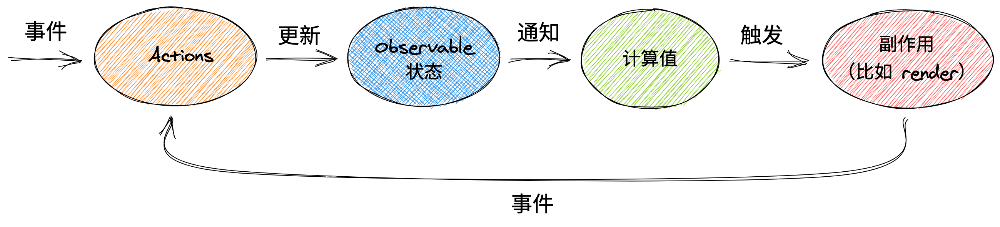

### Mobx

> Mobx 是一个简单的, 可扩展的 `javascript` 状态管理库(和 Redux, Vuex 类似), 一般和 `React` 结合使用, 最新版本 `6.3.12`

### Mobx 核心思想

> 任何源自应用状态的东西都应该自动的获得



1. 事件调用 `actions`, `Actions` 是唯一可以修改 `state` 的东西并且可能有其它副作用
2. 更新属性，完整的对象，数组，`Maps 和 Sets` 都可以被转化为可观察对象
3. 通知计算值可以用来从其他可观察对象中派生信息。 计算值采用惰性求值，会缓存其输出，并且只有当其依赖的可观察对象被改变时才会重新计算。 它们在不被任何值观察时会被暂时停用
4. 触发副作用, 会对 `state` 变化作出反应, 但它们不产生一个值, 而是会产生一些副作用(比如 `render UI`)

**简单的示例**

```js
import React, { StrictMode } from "react";
import ReactDOM from "react-dom";
import { makeAutoObservable } from "mobx";
import { observer } from "mobx-react";

// 对应用状态进行建模
class Timer {
  secondsPassed = 0;
  constructor() {
    makeAutoObservable(this);
  }

  // action
  increase() {
    this.secondsPassed += 1;
  }
  // action
  reset() {
    this.secondsPassed = 0;
  }
}
const myTimer = new Timer();

// TimerView 的 observer 包装会自动侦测到依赖于 observable timer.secondsPassed 的渲染——即使这种依赖关系没有被明确定义出来
//  响应性系统会负责在未来恰好那个字段被更新的时候将组件重新渲染
const TimerView = observer(({ timer }) => (
  // 事件 onClick
  <button onClick={() => timer.reset()}>已过秒数: {timer.secondsPassed}</button>
));

const rootElement = document.getElementById("root");
ReactDOM.render(
  <StrictMode>
    <TimerView timer={myTimer} />
  </StrictMode>,
  rootElement
);

// 事件 setInterval
setInterval(() => {
  myTimer.increase();
}, 1000);
```

### 安装

> Mobx 有两种 React 绑定方式; 1. `mobx-react-lite` 仅支持函数组件, `mobx-react` 还支持基于类的组件

### Mobx 主旨

**概念**

1. `State 状态`
2. `Actions 动作`
3. `Derivations 派生`

**State**

- `State(状态)` 是驱动你的应用程序的数据

  - 将 State 存储在任何您喜欢的数据结构中：普通对象、数组、类、循环数据结构或引用。这与 MobX 的工作方式无关。
  - 只要确保所有你想随时间改变的属性都被标记为`observable`，这样 MobX 就可以跟踪它们

  ```js
  import { makeAutoObservable, observable, action } from "mobx";
  class Todo {
    id = Math.random();
    title = "";
    finished = false;

    constructor(title) {
      // 进行显式设置
      makeAutoObservable(this, {
        title: observable,
        finished: observable,
        toggle: action,
      });
      this.title = title;
    }

    toggle() {
      this.finished = !this.finished;
    }
  }
  ```

- `Action(动作)` 是任意可以改变 `State(状态)` 的代码，比如用户事件处理、后端推送数据处理、调度器事件处理等等。

  - 使用 Action 可以帮助您更好地组织代码，并防止您在无意中修改 State
  - 建议您将所有修改 observable 值的代码标记为 action。MobX 可以自动进行事务处理以轻松实现最佳性能
  - 在 MobX 术语中，可以修改 State 的方法被称为 `action(动作) `

- 创建 `Derivations` 以便自动对 `State` 变化进行响应

  - 任何 `来源是State(状态)` 并且不需要进一步交互的东西都是 `Derivation(派生)`。
  - 派生包含很多种方式:
    - 用户界面
    - 派生数据: 比如剩余未完成的 todos 的数量
    - 后端集成: 发送改变到服务器
  - Mobx 区分了两种 `Derivation`
    - `Computed values`, 总是可以通过纯函数从当前可观测 State 中派生
    - `Reactions` 当 State 改变时需要自动运行的副作用
    - 当最开始使用 MobX 时，人们容易过度使用 Reaction, 黄金法则是，如果要基于当前 State 创建值，请始终使用 computed。
  - 通过 computed 对派生值进行建模

  ```js
  import { makeObservable, observable, computed } from "mobx";

  class TodoList {
    todos = [];
    // 通过定义 getter 方法并使用 makeObservable 将其标记为 computed 的方式创建一个 computed 值
    get unfinishedTodoCount() {
      return this.todos.filter((todo) => !todo.finished).length;
    }
    constructor(todos) {
      makeObservable(this, {
        todos: observable,
        unfinishedTodoCount: computed,
      });

      this.todos = todos;
    }
  }
  ```

  - 使用 reaction 对副作用建模
    - Reaction 和 computed 类似，但并不产生信息，而是产生副作用，如打印到控制台、发出网络请求、增量更新 React 组件树以便更新 DOM 等
    - reaction 是 响应式编程和指令式编程之间的桥梁
    - 到目前为止，最常用的 reaction 形式是 UI 组件。 注意，action 和 reaction 都可能引起副作用。 副作用应有一个清晰的、显式的起源，例如在提交表单时发出网络请求，应该从相关的事件处理程序显式触发
  - 自定义 Reaction
    - 通常情况下你不需要使用它们，可以使用 autorun ,reaction 或 when 方法来订制你的特殊业务场景
    ```js
    // 一个自动观察state的函数
    // autorun 将在unfinishedTodoCount的数量发生变化时输出日志
    autorun(() => {
      console.log("Tasks left: " + todos.unfinishedTodoCount);
    });
    ```

> Mobx 使用单向数据流，利用 action 改变 state ，进而更新所有受影响的 view

1. 所有的 derivations 将在 state 改变时自动且原子化地更新。因此不可能观察中间值。
2. 所有的 dervations 默认将会同步更新，这意味着 action 可以在 state 改变 之后安全的直接获得 computed 值。
3. computed value 的更新是惰性的，任何 computed value 在需要他们的副作用发生之前都是不激活的。
4. 所有的 computed value 都应是纯函数,他们不应该修改 state。

---

### Observable State 创建可观察状态

> 属性，完整的对象，数组，Maps 和 Sets 都可以被转化为可观察对象。 使得对象可观察的基本方法是使用 makeObservable 为每个属性指定一个注解, 注解在下

1. `observable` 定义一个存储 `state` 的可追踪字段
2. `action` 将一个方法标记为可以修改 state 的 action
3. `computed` 标记一个可以由 state 派生出新的值并且缓存其输出的 getter

**makeObservable**

用法: `makeObservable(target, annotations?, options?)`

这个函数可以捕获已经存在的对象属性并且使得它们可观察。任何 JavaScript 对象（包括类的实例）都可以作为 target 被传递给这个函数。 一般情况下，`makeObservable` 是在类的构造函数中调用的，并且它的`第一个参数是 this` 。 `annotations 参数将会为每一个成员映射 注解`

```js
import { makeObservable, observable, computed, action, flow } from "mobx";
class Doubler {
  value;
  constructor(value) {
    // 所有带注解 的字段都是 不可配置的。
    // 所有的不可观察（无状态）的字段（action, flow）都是 不可写的。
    makeObservable(this, {
      value: observable,
      double: computed,
      increment: action,
      fetch: flow,
    });
    this.value = value;
  }
  get double() {
    return this.value * 2;
  }
  increment() {
    this.value++;
  }
  *fetch() {
    const res = yield fetch("/api/value");
    this.value = res.json();
  }
}
```

**makeAutoObservable**

用法: `makeAutoObservable(target, overrides?, options?)`

- makeAutoObservable 就像是加强版的 makeObservable，在默认情况下`它将推断所有的属性`。你仍然可以使用 overrides 重写某些注解的默认行为, 推断规则如下
  - 所有 自有 属性都成为 observable。
  - 所有 getters 都成为 computed。
  - 所有 setters 都成为 action。
  - 所有 prototype 中的 functions 都成为 autoAction。
  - 所有 prototype 中的 generator functions 都成为 flow。（需要注意，generators 函数在某些编译器配置中无法被检测到，如果 flow 没有正常运行，请务必明确地指定 flow 注解。）
  - 在 overrides 参数中标记为 false 的成员将不会被添加注解。例如，将其用于像标识符这样的只读字段。
- makeAutoObservable 不能被用于带有 super 的类或 子类。

**observable**

用法: `observable(source, overrides?, options?)`

- observable 注解可以作为一个函数进行调用，从而一次性将整个对象变成可观察的。 source 对象将会被克隆并且所有的成员都将会成为可观察的，类似于 makeAutoObservable 做的那样。 同样，你可以传入一个 overrides 对象来为特定的成员提供特定的注解

- 由 observable 返回的对象将会使用 Proxy 包装，这意味着之后被添加到这个对象中的属性也将被侦测并使其转化为可观察对象

---

### Actions

> 默认情况下，不允许在 actions 之外改变 state

```js
import { makeObservable, observable, action } from "mobx";

class Doubler {
  value = 0;

  constructor(value) {
    makeObservable(this, {
      value: observable,
      increment: action,
    });
  }

  increment() {
    // 观察者不会看到中间状态.
    this.value++;
    this.value++;
  }
}
```

### 使用 `action` 包装函数

- 为了尽可能地利用 MobX 的事务性，actions 应该尽可能被传到外围。如果一个类方法会修改 state，可以将其标记为 action
- 把事件处理函数标记为 actions 就更好了，因为最外层的事务起着决定性作用。一个未被标记的、会接着调用两个 actions 的事件处理函数仍然将会生成两个事务
- 为了帮助创建基于 action 的事件处理函数，action 不仅仅是一个注解，更是一个高阶函数。可以使用函数将它作为一个参数来调用，在这种情况下它将会返回一个有着相同签名的使用 action 包装过的函数

```js
const ResetButton = ({ formState }) => {
  <button
    onClick={action((e) => {
      formState.resetPending();
      formState.resetvalues();
      e.stopPropagation();
    })}
  >
    reset form
  </button>;
};
```

### action.bound 注解

用法: `action.bound`, action.bound 注解可用于将方法自动绑定到正确的实例，这样 this 会始终被正确绑定在函数内部

`tips: 使用 makeAutoObservable(o, {}, { autoBind: true }) 自动绑定所有的 actions 和 flows`

```js
import { makeAutoObservable } from "mobx";

class Doubler {
  value = 0;

  constructor(value) {
    makeAutoObservable(this, {}, { autoBind: true });
  }

  increment() {
    this.value++;
    this.value++;
  }

  *flow() {
    const response = yield fetch("http://example.com/value");
    this.value = yield response.json();
  }
}
```

### runInAction

用法: `runInAction(fn)` 这个工具函数来创建一个会被立即调用的临时 action。在异步进程中非常有用

```js
import { observable, runInAction } from "mobx";

const state = observable({ value: 0 });

runInAction(() => {
  state.value++;
  state.value++;
});
```

### 异步 actions

> 从本质上讲，异步进程在 MobX 中不需要任何特殊处理，因为不论是何时引发的所有 reactions 都将会自动更新。 而且因为可观察对象是可变的，因此在 action 执行过程中保持对它们的引用一般是安全的

> 然而，在异步进程中更新可观察对象的每个步骤（tick）都应该被标识为 action。 我们可以通过利用上述的 API 以多种方式实现这一点，如下所示。

1. 处理 Promise

```js
// Promise 的决议处理程序是我们以内联的方式处理的，但是会在一开始的 action 执行完成之后运行，因此需要使用 action 对它们进行包装

import { action, makeAutoObservable } from "mobx";

class Store {
  githubProjects = [];
  state = "pending"; // "pending", "done" or "error"

  constructor() {
    makeAutoObservable(this);
  }

  fetchProjects() {
    this.githubProjects = [];
    this.state = "pending";
    fetchGithubProjectsSomehow().then(
      action("fetchSuccess", (projects) => {
        const filteredProjects = somePreprocessing(projects);
        this.githubProjects = filteredProjects;
        this.state = "done";
      }),
      action("fetchError", (error) => {
        this.state = "error";
      })
    );
  }
}
Î;
```

2. `async/await + runInAction`

```js
// await 之后的任何操作都不与其同在一个 tick 中，因此它们需要使用 action 包装。 在这里，我们可以利用 runInAction
import { runInAction, makeAutoObservable } from "mobx";

class Store {
  githubProjects = [];
  state = "pending"; // "pending", "done" or "error"

  constructor() {
    makeAutoObservable(this);
  }

  async fetchProjects() {
    this.githubProjects = [];
    this.state = "pending";
    try {
      const projects = await fetchGithubProjectsSomehow();
      const filteredProjects = somePreprocessing(projects);
      runInAction(() => {
        this.githubProjects = filteredProjects;
        this.state = "done";
      });
    } catch (e) {
      runInAction(() => {
        this.state = "error";
      });
    }
  }
}
```

3. 使用 flow 代替 async / await {🚀}

用法: flow: 注解

> flow 包装器是一个可选的 async / await 替代方案，它让 MobX action 使用起来更加容易, 如何使用

1. 使用 flow 包装你的异步函数
2. 使用 function \* 代替 async
3. 使用 yield 代替 await

```js
import { flow, makeAutoObservable, flowResult } from "mobx";

class Store {
  githubProjects = [];
  state = "pending";

  constructor() {
    makeAutoObservable(this, {
      fetchProjects: flow,
    });
  }

  // 注意星号, 这是一个 generator 函数!
  *fetchProjects() {
    this.githubProjects = [];
    this.state = "pending";
    try {
      // Yield 代替 await.
      const projects = yield fetchGithubProjectsSomehow();
      const filteredProjects = somePreprocessing(projects);
      this.state = "done";
      this.githubProjects = filteredProjects;
    } catch (error) {
      this.state = "error";
    }
  }
}

const store = new Store();
const projects = await flowResult(store.fetchProjects());
```

```js
// 上面例子改写
/**
 * 好处是我们不再需要 flowResult 了，
 * 坏处是需要指定 this 的类型，以便确保它的类型会被正确推断出来
 */

import { flow } from "mobx";

class Store {
  githubProjects = [];
  state = "pending";

  fetchProjects = flow(function* (this: Store) {
    this.githubProjects = [];
    this.state = "pending";
    try {
      // yield 代替 await.
      const projects = yield fetchGithubProjectsSomehow();
      const filteredProjects = somePreprocessing(projects);
      this.state = "done";
      this.githubProjects = filteredProjects;
    } catch (error) {
      this.state = "error";
    }
  });
}

const store = new Store();
const projects = await store.fetchProjects();
```

---

### computed